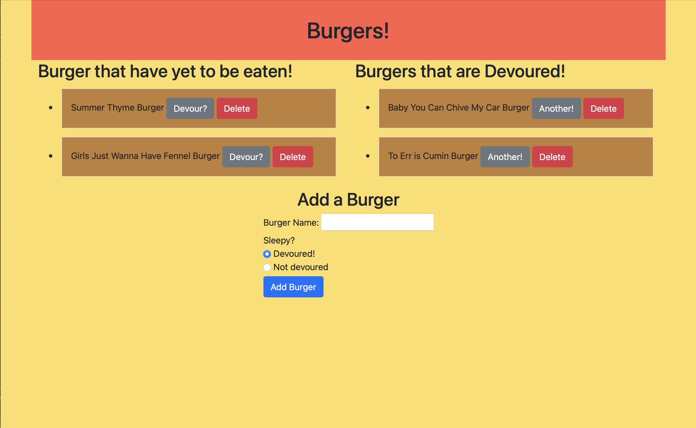

# EatDaBurger

## Purpose

The webpage allows the user to make a list of burgers they would like to eat, and mark them as devoured once they are eaten. It is hosted on Heroku and uses JawsDB to save the burgers. 

## Screenshot

## How to View

To view, go to the web address listed below.

[Link](https://boiling-shelf-95517.herokuapp.com)

## Questions

You can find my Github user profile [here.](https://github.com/calebkw91)
View my professional portfolio [here.](https://calebkw91.github.io/ResponsivePortfolio/)
I can be reached by email at walke1291@gmail.com